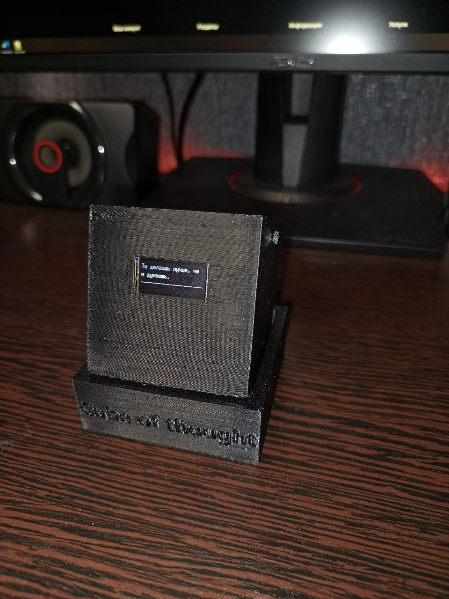

# CubeOfThought-
Миниатюрное устройство с фразами поддержки на OLED-дисплее

## Особенности
- До 100+ фраз
- Прокрутка длинных фраз
- Сенсорные кнопки вперёд/назад
- STL и .blend для 3D-печати корпуса

## Компоненты
- ESP32 / Arduino
- OLED дисплей 128x64 (I2C)
- 2x сенсорные кнопки TTP223
- TP4056 и Li-ion аккумулятор
- Тумблер включения

## Код
Всё находится в `Cube_of_thougth.ino`.

## Модели
В папке `models/` — `.stl` и `.blend`.